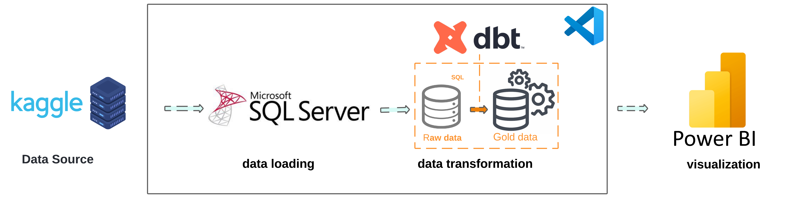

# Microsoft-dbt

## Table of Contents 📋
- [Overview](#overview)
- [Installation](#installation)
- [Usage](#usage)
- [Difficulties](#difficulties)
- [Points to Improve](#points-to-improve)
- [Tools](#tools)
- [Architecture](#architecture)
- [Dashboard](#dashboard)
- [Contact](#contact)
  ## 🚀 Overview
This project focuses on analyzing Microsoft product data using **dbt** (Data Build Tool). The analysis is performed to extract insights from product data, transform raw data into meaningful reports, and provide actionable insights for Microsoft product performance.
## 🛠️ Installation
To set up and run this project locally, follow these steps:
1. Clone the repository:
    ```bash
    git clone https://github.com/Samiha128/Microsoft-dbt/tree/main  
    ```
2. Navigate to the project directory:
    ```bash
    cd microsoft-dbt
    ```
3. Install the required dependencies:
    ```bash
    pip install -r requirements.txt
    ```
4. Install and set up dbt:
    ```bash
    pip install dbt-core dbt-sqlserver

    ```

5. Set up your profiles for dbt:
    Create a `profiles.yml` file in `~/.dbt/` and include your database credentials:
    ```yaml
    microsoft_dbt:
      outputs:
        dev:
          type: sqlserver
          host: your-host
          user: your-username
          password: your-password
          dbname: microsoft_dbt
          schema: public
          threads: 4
          port: 5432
      target: dev
    ```

6. Run dbt commands to set up the environment:
    ```bash
    dbt deps
    dbt seed
    dbt run
    dbt test
    ```

## 🚀 Usage
This project includes dbt models to transform raw Microsoft product data into meaningful datasets for analysis.

### Steps to run the project:

1. **Run the dbt models** to transform your raw data into analytics-ready data:
    ```bash
    dbt run
    ```
2. **Test the data models** to ensure correctness:
    ```bash
    dbt test
    ```
3. **Generate documentation** for the data models:
    ```bash
    dbt docs generate
    ```
4. **View the documentation** in a web browser:
    ```bash
    dbt docs serve
    ```
## 🛠️ Difficulties
- Handling large datasets efficiently.
- Ensuring the performance of complex transformation queries in dbt.
- Managing incremental loads for continuously updated data.

## 🔧 Points to Improve
- Optimize transformation logic to reduce processing time.
- Implement more detailed data quality checks using dbt’s built-in testing framework.
- Improve the modularity of dbt models for better reusability.
## 🛠 Tools
- **dbt (Data Build Tool)**: For transformation and analysis of data.
- **SQL Server**: As the database for storing Microsoft product data.
- **Git**: For version control.
## 🏗 Architecture
The architecture of the project consists of:
1. **Raw Data**: Microsoft product data collected from various sources.
2. **dbt Models**: Transformation layers that clean and structure the data.
3. **Analytics**: Ready-to-use datasets for analysis and reporting.


## 📞 Contact
For any questions or issues, feel free to reach out:
[](https://www.linkedin.com/in/samiha-el-mansouri-27505b250/)
